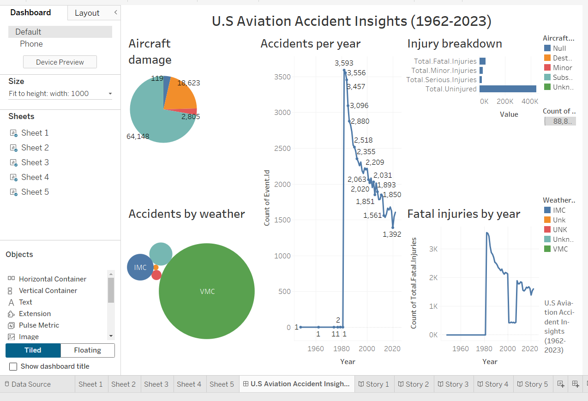

# ✈ Aviation Accident Analysis (1962–2023)

## Business Understanding
The aviation industry relies heavily on safety, and understanding historical accident data is key to making informed improvements. This project analyzes data from the National Transportation Safety Board (NTSB) to uncover trends, common causes of accidents, and risk patterns. The insights are intended to support better decision-making in aviation safety practices.

## Project Overview
- *Tools Used*: Python (Pandas, Matplotlib), Tableau
- *Data Source*: NTSB Aviation Accident Database (1962–2023)
- *Deliverables*:
  - Data cleaning and analysis using Jupyter Notebook
  - Interactive and static data visualizations using Tableau
  - Summary presentation for stakeholders
  - A complete dashboard displaying key metrics

## Repository Structure

##  Dashboard Preview

## How to Use

1. Open notebook.ipynb to explore the cleaned and analyzed dataset.
2. View Tableau dashboard in /dashboard.
3. See summary insights in /presentation/aviation_presentation.pdf.
